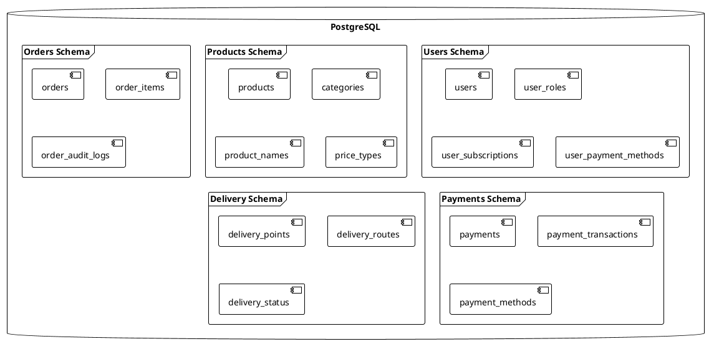

# Database Schema

## Overview

FoodHouse uses PostgreSQL as its primary database. The database is designed to support the microservices architecture, with each service having its own database schema.

## Database Architecture



## Users Schema

### users
```sql
CREATE TABLE users (
    user_id UUID PRIMARY KEY,
    role VARCHAR(20) NOT NULL,
    phone_number VARCHAR(20) NOT NULL UNIQUE,
    email VARCHAR(255) UNIQUE,
    first_name VARCHAR(100),
    last_name VARCHAR(100),
    residence_country_iso_code CHAR(2) NOT NULL,
    location_coordinates POINT,
    profile_image VARCHAR(255),
    address TEXT,
    created_at TIMESTAMP WITH TIME ZONE DEFAULT CURRENT_TIMESTAMP,
    updated_at TIMESTAMP WITH TIME ZONE DEFAULT CURRENT_TIMESTAMP
);
```

### user_roles
```sql
CREATE TABLE user_roles (
    role_id UUID PRIMARY KEY,
    user_id UUID REFERENCES users(user_id),
    role_type VARCHAR(20) NOT NULL,
    created_at TIMESTAMP WITH TIME ZONE DEFAULT CURRENT_TIMESTAMP,
    updated_at TIMESTAMP WITH TIME ZONE DEFAULT CURRENT_TIMESTAMP
);
```

### user_subscriptions
```sql
CREATE TABLE user_subscriptions (
    subscription_id UUID PRIMARY KEY,
    user_id UUID REFERENCES users(user_id),
    subscription_type VARCHAR(50) NOT NULL,
    start_date TIMESTAMP WITH TIME ZONE NOT NULL,
    end_date TIMESTAMP WITH TIME ZONE NOT NULL,
    status VARCHAR(20) NOT NULL,
    created_at TIMESTAMP WITH TIME ZONE DEFAULT CURRENT_TIMESTAMP,
    updated_at TIMESTAMP WITH TIME ZONE DEFAULT CURRENT_TIMESTAMP
);
```

### user_payment_methods
```sql
CREATE TABLE user_payment_methods (
    payment_method_id UUID PRIMARY KEY,
    user_id UUID REFERENCES users(user_id),
    method_type VARCHAR(20) NOT NULL,
    account_number VARCHAR(50) NOT NULL,
    is_default BOOLEAN DEFAULT FALSE,
    created_at TIMESTAMP WITH TIME ZONE DEFAULT CURRENT_TIMESTAMP,
    updated_at TIMESTAMP WITH TIME ZONE DEFAULT CURRENT_TIMESTAMP
);
```

## Products Schema

### products
```sql
CREATE TABLE products (
    product_id UUID PRIMARY KEY,
    category_id UUID REFERENCES categories(category_id),
    name VARCHAR(255) NOT NULL,
    unit_type VARCHAR(50) NOT NULL,
    amount DECIMAL(10,2) NOT NULL,
    currency CHAR(3) NOT NULL,
    description TEXT,
    image VARCHAR(255),
    created_by UUID REFERENCES users(user_id),
    created_at TIMESTAMP WITH TIME ZONE DEFAULT CURRENT_TIMESTAMP,
    updated_at TIMESTAMP WITH TIME ZONE DEFAULT CURRENT_TIMESTAMP
);
```

### categories
```sql
CREATE TABLE categories (
    category_id UUID PRIMARY KEY,
    name VARCHAR(100) NOT NULL,
    slug VARCHAR(100) NOT NULL UNIQUE,
    created_by UUID REFERENCES users(user_id),
    created_at TIMESTAMP WITH TIME ZONE DEFAULT CURRENT_TIMESTAMP,
    updated_at TIMESTAMP WITH TIME ZONE DEFAULT CURRENT_TIMESTAMP
);
```

### product_names
```sql
CREATE TABLE product_names (
    name_id UUID PRIMARY KEY,
    name VARCHAR(255) NOT NULL,
    slug VARCHAR(255) NOT NULL UNIQUE,
    category_id UUID REFERENCES categories(category_id),
    created_at TIMESTAMP WITH TIME ZONE DEFAULT CURRENT_TIMESTAMP,
    updated_at TIMESTAMP WITH TIME ZONE DEFAULT CURRENT_TIMESTAMP
);
```

### price_types
```sql
CREATE TABLE price_types (
    price_type_id UUID PRIMARY KEY,
    name VARCHAR(50) NOT NULL,
    slug VARCHAR(50) NOT NULL UNIQUE,
    category_id UUID REFERENCES categories(category_id),
    created_at TIMESTAMP WITH TIME ZONE DEFAULT CURRENT_TIMESTAMP,
    updated_at TIMESTAMP WITH TIME ZONE DEFAULT CURRENT_TIMESTAMP
);
```

## Orders Schema

### orders
```sql
CREATE TABLE orders (
    order_number BIGSERIAL PRIMARY KEY,
    user_id UUID REFERENCES users(user_id),
    delivery_location POINT NOT NULL,
    price DECIMAL(10,2) NOT NULL,
    currency CHAR(3) NOT NULL,
    status VARCHAR(20) NOT NULL,
    rating INTEGER,
    review TEXT,
    product_id UUID REFERENCES products(product_id),
    created_by UUID REFERENCES users(user_id),
    created_at TIMESTAMP WITH TIME ZONE DEFAULT CURRENT_TIMESTAMP,
    updated_at TIMESTAMP WITH TIME ZONE DEFAULT CURRENT_TIMESTAMP,
    secret_key VARCHAR(100) NOT NULL,
    product_owner UUID REFERENCES users(user_id),
    payout_phone_number VARCHAR(20)
);
```

### order_items
```sql
CREATE TABLE order_items (
    item_id UUID PRIMARY KEY,
    order_number BIGINT REFERENCES orders(order_number),
    product_id UUID REFERENCES products(product_id),
    quantity INTEGER NOT NULL,
    unit_price DECIMAL(10,2) NOT NULL,
    currency CHAR(3) NOT NULL,
    created_at TIMESTAMP WITH TIME ZONE DEFAULT CURRENT_TIMESTAMP,
    updated_at TIMESTAMP WITH TIME ZONE DEFAULT CURRENT_TIMESTAMP
);
```

### order_audit_logs
```sql
CREATE TABLE order_audit_logs (
    log_id UUID PRIMARY KEY,
    order_number BIGINT REFERENCES orders(order_number),
    actor UUID REFERENCES users(user_id),
    action VARCHAR(50) NOT NULL,
    reason TEXT,
    before_state JSONB,
    after_state JSONB,
    created_at TIMESTAMP WITH TIME ZONE DEFAULT CURRENT_TIMESTAMP
);
```

## Payments Schema

### payments
```sql
CREATE TABLE payments (
    payment_id UUID PRIMARY KEY,
    payment_entity VARCHAR(20) NOT NULL,
    entity_id UUID NOT NULL,
    amount DECIMAL(10,2) NOT NULL,
    currency CHAR(3) NOT NULL,
    created_by UUID REFERENCES users(user_id),
    created_at TIMESTAMP WITH TIME ZONE DEFAULT CURRENT_TIMESTAMP,
    expires_at TIMESTAMP WITH TIME ZONE NOT NULL,
    updated_at TIMESTAMP WITH TIME ZONE DEFAULT CURRENT_TIMESTAMP,
    status VARCHAR(20) NOT NULL,
    payment_method_id UUID REFERENCES payment_methods(payment_method_id)
);
```

### payment_transactions
```sql
CREATE TABLE payment_transactions (
    transaction_id UUID PRIMARY KEY,
    payment_id UUID REFERENCES payments(payment_id),
    amount DECIMAL(10,2) NOT NULL,
    currency CHAR(3) NOT NULL,
    status VARCHAR(20) NOT NULL,
    reference VARCHAR(100) NOT NULL,
    operator VARCHAR(50),
    operator_reference VARCHAR(100),
    created_at TIMESTAMP WITH TIME ZONE DEFAULT CURRENT_TIMESTAMP,
    updated_at TIMESTAMP WITH TIME ZONE DEFAULT CURRENT_TIMESTAMP
);
```

### payment_methods
```sql
CREATE TABLE payment_methods (
    payment_method_id UUID PRIMARY KEY,
    method_type VARCHAR(20) NOT NULL,
    account_number VARCHAR(50) NOT NULL,
    created_at TIMESTAMP WITH TIME ZONE DEFAULT CURRENT_TIMESTAMP,
    updated_at TIMESTAMP WITH TIME ZONE DEFAULT CURRENT_TIMESTAMP
);
```

## Delivery Schema

### delivery_points
```sql
CREATE TABLE delivery_points (
    point_id UUID PRIMARY KEY,
    address POINT NOT NULL,
    delivery_point_name VARCHAR(255) NOT NULL,
    city VARCHAR(100) NOT NULL,
    created_at TIMESTAMP WITH TIME ZONE DEFAULT CURRENT_TIMESTAMP,
    updated_at TIMESTAMP WITH TIME ZONE DEFAULT CURRENT_TIMESTAMP
);
```

### delivery_routes
```sql
CREATE TABLE delivery_routes (
    route_id UUID PRIMARY KEY,
    order_number BIGINT REFERENCES orders(order_number),
    delivery_point_id UUID REFERENCES delivery_points(point_id),
    status VARCHAR(20) NOT NULL,
    created_at TIMESTAMP WITH TIME ZONE DEFAULT CURRENT_TIMESTAMP,
    updated_at TIMESTAMP WITH TIME ZONE DEFAULT CURRENT_TIMESTAMP
);
```

### delivery_status
```sql
CREATE TABLE delivery_status (
    status_id UUID PRIMARY KEY,
    order_number BIGINT REFERENCES orders(order_number),
    status VARCHAR(20) NOT NULL,
    location POINT,
    created_at TIMESTAMP WITH TIME ZONE DEFAULT CURRENT_TIMESTAMP,
    updated_at TIMESTAMP WITH TIME ZONE DEFAULT CURRENT_TIMESTAMP
);
```

## Indexes

### Users Schema Indexes
```sql
CREATE INDEX idx_users_phone_number ON users(phone_number);
CREATE INDEX idx_users_email ON users(email);
CREATE INDEX idx_users_role ON users(role);
CREATE INDEX idx_user_roles_user_id ON user_roles(user_id);
CREATE INDEX idx_user_subscriptions_user_id ON user_subscriptions(user_id);
CREATE INDEX idx_user_payment_methods_user_id ON user_payment_methods(user_id);
```

### Products Schema Indexes
```sql
CREATE INDEX idx_products_category_id ON products(category_id);
CREATE INDEX idx_products_created_by ON products(created_by);
CREATE INDEX idx_categories_slug ON categories(slug);
CREATE INDEX idx_product_names_slug ON product_names(slug);
CREATE INDEX idx_price_types_category_id ON price_types(category_id);
```

### Orders Schema Indexes
```sql
CREATE INDEX idx_orders_user_id ON orders(user_id);
CREATE INDEX idx_orders_status ON orders(status);
CREATE INDEX idx_orders_product_owner ON orders(product_owner);
CREATE INDEX idx_order_items_order_number ON order_items(order_number);
CREATE INDEX idx_order_audit_logs_order_number ON order_audit_logs(order_number);
```

### Payments Schema Indexes
```sql
CREATE INDEX idx_payments_entity_id ON payments(entity_id);
CREATE INDEX idx_payments_status ON payments(status);
CREATE INDEX idx_payment_transactions_payment_id ON payment_transactions(payment_id);
CREATE INDEX idx_payment_transactions_reference ON payment_transactions(reference);
```

### Delivery Schema Indexes
```sql
CREATE INDEX idx_delivery_points_city ON delivery_points(city);
CREATE INDEX idx_delivery_routes_order_number ON delivery_routes(order_number);
CREATE INDEX idx_delivery_status_order_number ON delivery_status(order_number);
```

## Constraints

### Foreign Key Constraints
- All foreign key relationships are enforced with `ON DELETE RESTRICT`
- Cascading updates are not enabled to maintain data integrity

### Unique Constraints
- Phone numbers must be unique across all users
- Email addresses must be unique across all users
- Category slugs must be unique
- Product name slugs must be unique
- Price type slugs must be unique within a category

### Check Constraints
```sql
ALTER TABLE users
ADD CONSTRAINT check_user_role
CHECK (role IN ('FARMER', 'BUYER', 'ADMIN'));

ALTER TABLE orders
ADD CONSTRAINT check_order_status
CHECK (status IN ('CREATED', 'PAYMENT_SUCCESSFUL', 'PAYMENT_FAILED', 'IN_TRANSIT', 'DELIVERED', 'APPROVED'));

ALTER TABLE payments
ADD CONSTRAINT check_payment_status
CHECK (status IN ('INITIATED', 'COMPLETED', 'FAILED', 'CANCELED'));
```

## Data Types

### Custom Types
```sql
CREATE TYPE user_role AS ENUM ('FARMER', 'BUYER', 'ADMIN');
CREATE TYPE order_status AS ENUM ('CREATED', 'PAYMENT_SUCCESSFUL', 'PAYMENT_FAILED', 'IN_TRANSIT', 'DELIVERED', 'APPROVED');
CREATE TYPE payment_status AS ENUM ('INITIATED', 'COMPLETED', 'FAILED', 'CANCELED');
CREATE TYPE payment_method_type AS ENUM ('MOBILE_MONEY', 'ORANGE_MONEY', 'CREDIT_CARD');
```

## Database Maintenance

### Backup Strategy
- Daily full backups
- Hourly incremental backups
- Point-in-time recovery enabled
- Backup retention: 30 days

### Vacuum Strategy
- Automatic vacuum enabled
- Vacuum analyze on low-usage periods
- Table statistics updated daily

### Monitoring
- Table size monitoring
- Index usage monitoring
- Query performance monitoring
- Connection pool monitoring

## Security

### Access Control
- Role-based access control
- Schema-level permissions
- Row-level security where applicable
- Encrypted sensitive data

### Data Protection
- Data encryption at rest
- Data encryption in transit
- Secure password hashing
- Audit logging enabled

## Performance Optimization

### Query Optimization
- Prepared statements
- Query plan analysis
- Index usage optimization
- Connection pooling

### Resource Management
- Connection limits
- Statement timeout
- Idle transaction timeout
- Memory limits

## Migration Strategy

### Version Control
- Schema changes in version control
- Migration scripts for each change
- Rollback scripts available
- Version tracking in database

### Deployment
- Zero-downtime migrations
- Blue-green deployment support
- Automated migration testing
- Backup before migration 