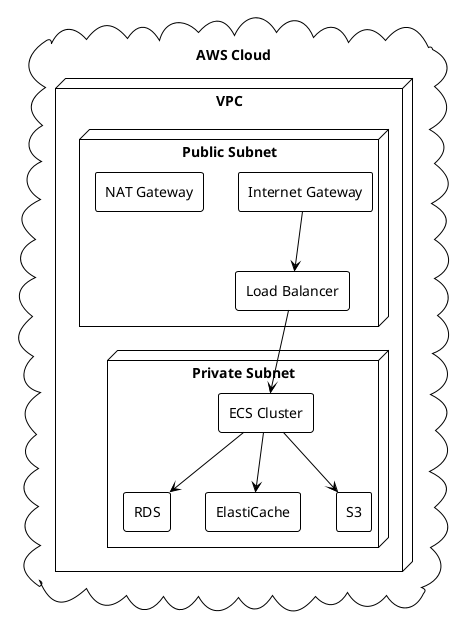

# Deployment Guide

## Overview

This guide provides comprehensive instructions for deploying the FoodHouse application in various environments. The application is designed to be deployed as a set of microservices using Docker containers and orchestrated with Kubernetes.

## Prerequisites

### Required Tools
- Docker (v20.10+)
- Docker Compose (v2.0+)
- Kubernetes (v1.20+)
- kubectl (v1.20+)
- AWS CLI (v2.0+)
- Terraform (v1.0+)
- Helm (v3.0+)

### Required Accounts
- AWS Account
- Docker Hub Account
- GitHub Account

## Infrastructure Setup

### AWS Infrastructure



### Terraform Configuration

```hcl
# main.tf
provider "aws" {
  region = var.aws_region
}

module "vpc" {
  source = "./modules/vpc"
  
  vpc_cidr = var.vpc_cidr
  environment = var.environment
}

module "ecs" {
  source = "./modules/ecs"
  
  vpc_id = module.vpc.vpc_id
  environment = var.environment
}

module "rds" {
  source = "./modules/rds"
  
  vpc_id = module.vpc.vpc_id
  environment = var.environment
}

module "elasticache" {
  source = "./modules/elasticache"
  
  vpc_id = module.vpc.vpc_id
  environment = var.environment
}
```

## Container Configuration

### Docker Compose

```yaml
version: '3.8'

services:
  users:
    build: ./users
    ports:
      - "8080:8080"
    environment:
      - DB_HOST=postgres
      - DB_PORT=5432
      - DB_NAME=foodhouse_users
      - DB_USER=postgres
      - DB_PASSWORD=secret
    depends_on:
      - postgres

  products:
    build: ./products
    ports:
      - "8081:8080"
    environment:
      - DB_HOST=postgres
      - DB_PORT=5432
      - DB_NAME=foodhouse_products
      - DB_USER=postgres
      - DB_PASSWORD=secret
    depends_on:
      - postgres

  orders:
    build: ./orders
    ports:
      - "8082:8080"
    environment:
      - DB_HOST=postgres
      - DB_PORT=5432
      - DB_NAME=foodhouse_orders
      - DB_USER=postgres
      - DB_PASSWORD=secret
    depends_on:
      - postgres

  payments:
    build: ./payments
    ports:
      - "8083:8080"
    environment:
      - DB_HOST=postgres
      - DB_PORT=5432
      - DB_NAME=foodhouse_payments
      - DB_USER=postgres
      - DB_PASSWORD=secret
    depends_on:
      - postgres

  postgres:
    image: postgres:13
    environment:
      - POSTGRES_USER=postgres
      - POSTGRES_PASSWORD=secret
    volumes:
      - postgres_data:/var/lib/postgresql/data

volumes:
  postgres_data:
```

### Kubernetes Manifests

```yaml
# users-deployment.yaml
apiVersion: apps/v1
kind: Deployment
metadata:
  name: users
  namespace: foodhouse
spec:
  replicas: 3
  selector:
    matchLabels:
      app: users
  template:
    metadata:
      labels:
        app: users
    spec:
      containers:
      - name: users
        image: foodhouse/users:latest
        ports:
        - containerPort: 8080
        env:
        - name: DB_HOST
          valueFrom:
            secretKeyRef:
              name: db-secrets
              key: host
        - name: DB_PASSWORD
          valueFrom:
            secretKeyRef:
              name: db-secrets
              key: password
        resources:
          requests:
            memory: "256Mi"
            cpu: "200m"
          limits:
            memory: "512Mi"
            cpu: "500m"
```

## Deployment Process

### 1. Build and Push Docker Images

```bash
# Build images
docker build -t foodhouse/users:latest ./users
docker build -t foodhouse/products:latest ./products
docker build -t foodhouse/orders:latest ./orders
docker build -t foodhouse/payments:latest ./payments

# Push to registry
docker push foodhouse/users:latest
docker push foodhouse/products:latest
docker push foodhouse/orders:latest
docker push foodhouse/payments:latest
```

### 2. Deploy Infrastructure

```bash
# Initialize Terraform
terraform init

# Plan deployment
terraform plan -out=tfplan

# Apply changes
terraform apply tfplan
```

### 3. Deploy Kubernetes Resources

```bash
# Create namespace
kubectl create namespace foodhouse

# Apply secrets
kubectl apply -f k8s/secrets.yaml

# Deploy services
kubectl apply -f k8s/users-deployment.yaml
kubectl apply -f k8s/products-deployment.yaml
kubectl apply -f k8s/orders-deployment.yaml
kubectl apply -f k8s/payments-deployment.yaml

# Deploy ingress
kubectl apply -f k8s/ingress.yaml
```

## Environment Configuration

### Development

```yaml
# config/development.yaml
environment: development
log_level: debug
database:
  host: localhost
  port: 5432
  name: foodhouse_dev
  user: postgres
  password: secret
redis:
  host: localhost
  port: 6379
```

### Staging

```yaml
# config/staging.yaml
environment: staging
log_level: info
database:
  host: staging-db.foodhouse.com
  port: 5432
  name: foodhouse_staging
  user: ${DB_USER}
  password: ${DB_PASSWORD}
redis:
  host: staging-redis.foodhouse.com
  port: 6379
```

### Production

```yaml
# config/production.yaml
environment: production
log_level: warn
database:
  host: production-db.foodhouse.com
  port: 5432
  name: foodhouse_prod
  user: ${DB_USER}
  password: ${DB_PASSWORD}
redis:
  host: production-redis.foodhouse.com
  port: 6379
```

## Monitoring Setup

### Prometheus Configuration

```yaml
# prometheus.yml
global:
  scrape_interval: 15s
  evaluation_interval: 15s

scrape_configs:
  - job_name: 'users'
    static_configs:
      - targets: ['users:8080']
  - job_name: 'products'
    static_configs:
      - targets: ['products:8080']
  - job_name: 'orders'
    static_configs:
      - targets: ['orders:8080']
  - job_name: 'payments'
    static_configs:
      - targets: ['payments:8080']
```

### Grafana Dashboards

```json
{
  "dashboard": {
    "id": null,
    "title": "FoodHouse Services",
    "panels": [
      {
        "title": "Service Health",
        "type": "graph",
        "datasource": "Prometheus",
        "targets": [
          {
            "expr": "up",
            "legendFormat": "{{service}}"
          }
        ]
      },
      {
        "title": "Request Rate",
        "type": "graph",
        "datasource": "Prometheus",
        "targets": [
          {
            "expr": "rate(http_requests_total[5m])",
            "legendFormat": "{{service}}"
          }
        ]
      }
    ]
  }
}
```

## Security Configuration

### SSL/TLS Setup

```yaml
# cert-manager.yaml
apiVersion: cert-manager.io/v1
kind: Certificate
metadata:
  name: foodhouse-cert
  namespace: foodhouse
spec:
  secretName: foodhouse-tls
  issuerRef:
    name: letsencrypt-prod
    kind: ClusterIssuer
  dnsNames:
    - api.foodhouse.com
    - www.foodhouse.com
```

### Network Policies

```yaml
# network-policy.yaml
apiVersion: networking.k8s.io/v1
kind: NetworkPolicy
metadata:
  name: foodhouse-network-policy
  namespace: foodhouse
spec:
  podSelector:
    matchLabels:
      app: foodhouse
  policyTypes:
  - Ingress
  - Egress
  ingress:
  - from:
    - namespaceSelector:
        matchLabels:
          name: ingress-nginx
    ports:
    - protocol: TCP
      port: 8080
  egress:
  - to:
    - namespaceSelector:
        matchLabels:
          name: kube-system
    ports:
    - protocol: TCP
      port: 53
```

## Backup and Recovery

### Database Backup

```bash
#!/bin/bash
# backup.sh

# Set variables
BACKUP_DIR="/backups"
DATE=$(date +%Y%m%d_%H%M%S)
DB_NAME="foodhouse"

# Create backup
pg_dump -h $DB_HOST -U $DB_USER -d $DB_NAME > $BACKUP_DIR/$DB_NAME_$DATE.sql

# Compress backup
gzip $BACKUP_DIR/$DB_NAME_$DATE.sql

# Upload to S3
aws s3 cp $BACKUP_DIR/$DB_NAME_$DATE.sql.gz s3://foodhouse-backups/
```

### Recovery Process

```bash
#!/bin/bash
# restore.sh

# Set variables
BACKUP_FILE=$1
DB_NAME="foodhouse"

# Download from S3
aws s3 cp s3://foodhouse-backups/$BACKUP_FILE .

# Decompress backup
gunzip $BACKUP_FILE

# Restore database
psql -h $DB_HOST -U $DB_USER -d $DB_NAME < ${BACKUP_FILE%.gz}
```

## Scaling Configuration

### Horizontal Pod Autoscaling

```yaml
# hpa.yaml
apiVersion: autoscaling/v2
kind: HorizontalPodAutoscaler
metadata:
  name: users-hpa
  namespace: foodhouse
spec:
  scaleTargetRef:
    apiVersion: apps/v1
    kind: Deployment
    name: users
  minReplicas: 3
  maxReplicas: 10
  metrics:
  - type: Resource
    resource:
      name: cpu
      target:
        type: Utilization
        averageUtilization: 70
```

### Database Scaling

```yaml
# rds-scaling.yaml
apiVersion: autoscaling.k8s.io/v1
kind: VerticalPodAutoscaler
metadata:
  name: rds-vpa
spec:
  targetRef:
    apiVersion: "apps/v1"
    kind: Deployment
    name: postgres
  updatePolicy:
    updateMode: "Auto"
```

## Troubleshooting

### Common Issues

1. **Database Connection Issues**
   ```bash
   # Check database connectivity
   kubectl exec -it users-pod -- nc -zv postgres 5432
   
   # Check database logs
   kubectl logs -f postgres-pod
   ```

2. **Service Health Issues**
   ```bash
   # Check service health
   kubectl get pods -n foodhouse
   
   # Check service logs
   kubectl logs -f users-pod -n foodhouse
   ```

3. **Network Issues**
   ```bash
   # Check network policies
   kubectl get networkpolicy -n foodhouse
   
   # Check service endpoints
   kubectl get endpoints -n foodhouse
   ```

### Monitoring Commands

```bash
# Check pod status
kubectl get pods -n foodhouse

# Check service status
kubectl get services -n foodhouse

# Check deployment status
kubectl get deployments -n foodhouse

# Check logs
kubectl logs -f deployment/users -n foodhouse

# Check metrics
kubectl top pods -n foodhouse
```

## Maintenance Procedures

### Regular Maintenance

1. **Database Maintenance**
   ```bash
   # Vacuum database
   kubectl exec -it postgres-pod -- psql -U postgres -d foodhouse -c "VACUUM ANALYZE;"
   
   # Check database size
   kubectl exec -it postgres-pod -- psql -U postgres -d foodhouse -c "\l+"
   ```

2. **Log Rotation**
   ```bash
   # Rotate logs
   kubectl exec -it users-pod -- logrotate /etc/logrotate.conf
   ```

3. **Certificate Renewal**
   ```bash
   # Check certificate status
   kubectl get certificate -n foodhouse
   
   # Force certificate renewal
   kubectl delete certificate foodhouse-cert -n foodhouse
   ```

### Emergency Procedures

1. **Service Rollback**
   ```bash
   # Rollback deployment
   kubectl rollout undo deployment/users -n foodhouse
   ```

2. **Database Recovery**
   ```bash
   # Restore from backup
   ./restore.sh foodhouse_20240320_120000.sql.gz
   ```

3. **Emergency Scaling**
   ```bash
   # Scale up services
   kubectl scale deployment users --replicas=5 -n foodhouse
   ```

## Performance Optimization

### Resource Optimization

```yaml
# resource-limits.yaml
apiVersion: v1
kind: LimitRange
metadata:
  name: foodhouse-limits
  namespace: foodhouse
spec:
  limits:
  - default:
      cpu: 500m
      memory: 512Mi
    defaultRequest:
      cpu: 200m
      memory: 256Mi
    type: Container
```

### Cache Configuration

```yaml
# redis-config.yaml
apiVersion: v1
kind: ConfigMap
metadata:
  name: redis-config
  namespace: foodhouse
data:
  redis.conf: |
    maxmemory 2gb
    maxmemory-policy allkeys-lru
    appendonly yes
    appendfsync everysec
```

## Security Hardening

### Pod Security Policies

```yaml
# psp.yaml
apiVersion: policy/v1beta1
kind: PodSecurityPolicy
metadata:
  name: foodhouse-psp
spec:
  privileged: false
  seLinux:
    rule: RunAsAny
  runAsUser:
    rule: MustRunAsNonRoot
  fsGroup:
    rule: MustRunAs
    ranges:
    - min: 1
      max: 65535
```

### Network Security

```yaml
# network-security.yaml
apiVersion: networking.k8s.io/v1
kind: NetworkPolicy
metadata:
  name: foodhouse-network-policy
  namespace: foodhouse
spec:
  podSelector:
    matchLabels:
      app: foodhouse
  policyTypes:
  - Ingress
  - Egress
  ingress:
  - from:
    - namespaceSelector:
        matchLabels:
          name: ingress-nginx
    ports:
    - protocol: TCP
      port: 8080
  egress:
  - to:
    - namespaceSelector:
        matchLabels:
          name: kube-system
    ports:
    - protocol: TCP
      port: 53
```

## Disaster Recovery

### Backup Strategy

1. **Database Backups**
   - Daily full backups
   - Hourly incremental backups
   - Point-in-time recovery enabled

2. **Configuration Backups**
   - Kubernetes manifests
   - Terraform state
   - Environment configurations

3. **Application State**
   - Redis snapshots
   - File system backups
   - Log archives

### Recovery Procedures

1. **Full System Recovery**
   ```bash
   # Restore infrastructure
   terraform apply -backup=backup.tfstate
   
   # Restore databases
   ./restore.sh foodhouse_full_backup.sql.gz
   
   # Restore application state
   kubectl apply -f k8s/backup/
   ```

2. **Partial Recovery**
   ```bash
   # Restore specific service
   kubectl apply -f k8s/backup/users/
   
   # Restore specific database
   ./restore.sh foodhouse_users_backup.sql.gz
   ```

## Deployment Checklist

### Pre-deployment

- [ ] Review and update configuration files
- [ ] Run automated tests
- [ ] Check resource availability
- [ ] Verify backup systems
- [ ] Review security configurations

### Deployment

- [ ] Deploy infrastructure changes
- [ ] Deploy database migrations
- [ ] Deploy application services
- [ ] Verify service health
- [ ] Run smoke tests

### Post-deployment

- [ ] Monitor system metrics
- [ ] Check error logs
- [ ] Verify backup systems
- [ ] Update documentation
- [ ] Notify stakeholders 